# ML4RamanTilt

This project is my MSc final project at Trinity College Dublin.

## Project Overview

The primary objective of this project is to use Machine Learning (ML) methods to predict Raman tilt in optical fiber transmission and apply Transfer Learning (TL) techniques to adapt the trained model to different scenarios.

## Model Architecture

Previous studies utilized a fully connected network (FCN) with a neuron count gradually decreasing from 128 to 1. This project introduces an innovative Autoencoder (AE) architecture that not only meets the precision requirements for Raman tilt prediction but also significantly reduces the number of neurons, improving training and prediction speeds.

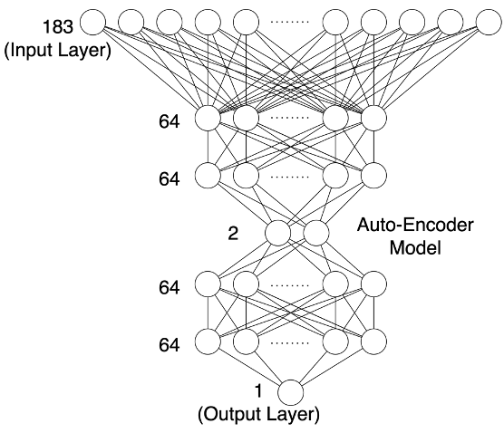
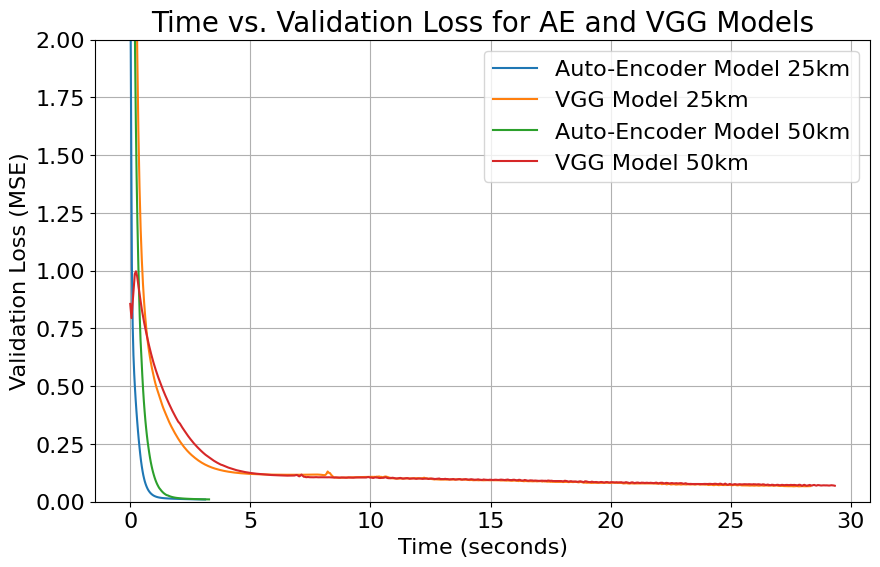
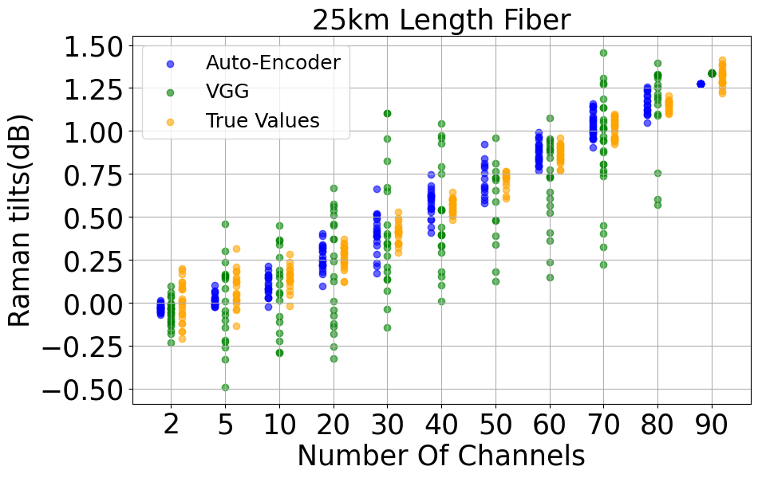
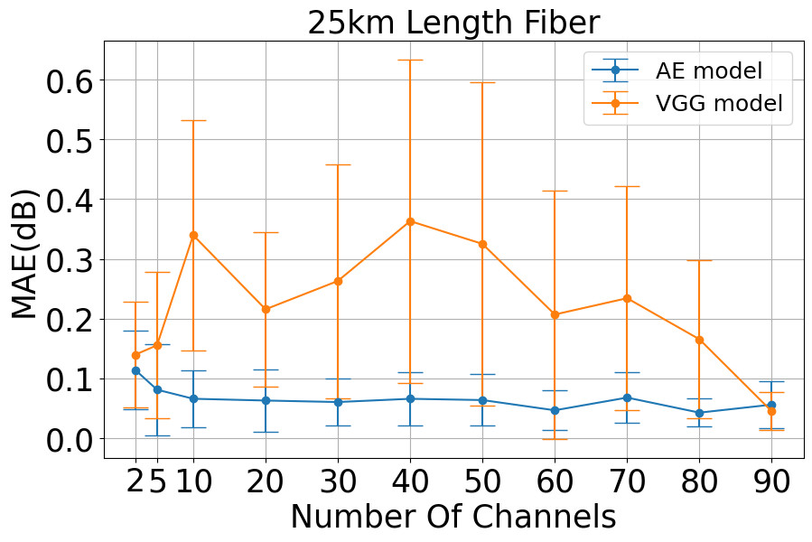
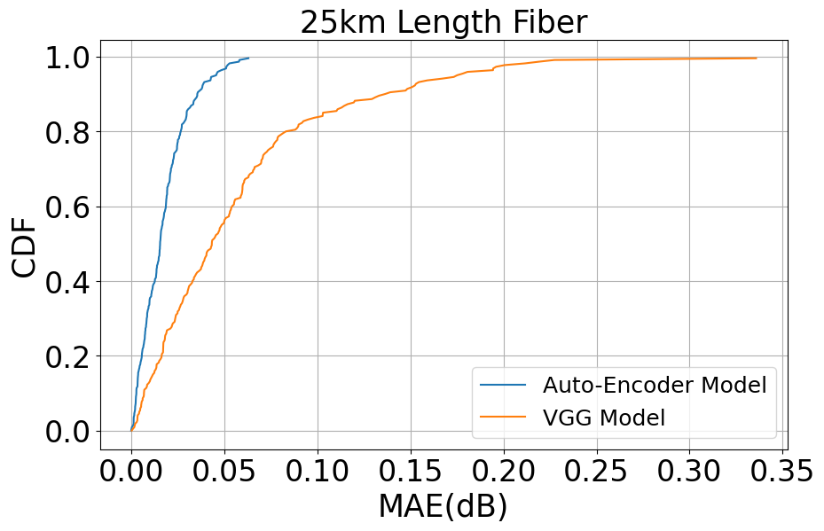

## Feature Engineering

The original dataset contained 183 features, which not only included excessive irrelevant information but also slowed down the training and computation speed. By analyzing the dataset, this project reduced the feature set to include only the total output power and derived 2 new features, resulting in a dataset with just 3 features. This reduction not only significantly decreased the Mean Absolute Error (MAE) but also improved training and computation speeds.

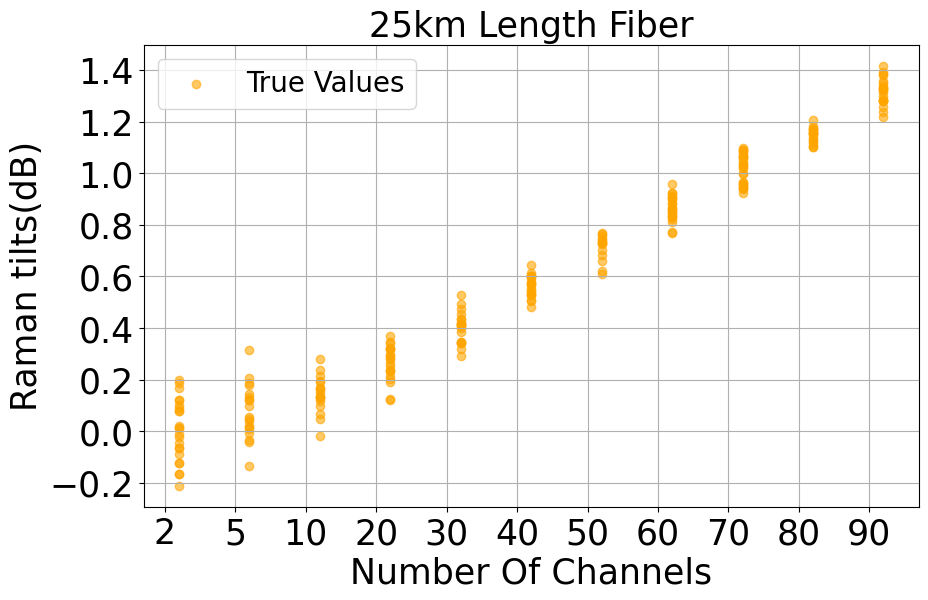

## Transfer Learning

This project also collected datasets from optical fibers with lengths of 25 km and 50 km. Each dataset was used to train a model, then a TL layer was added at the bottom of the trained base model. The base model was frozen, and the TL layer was trained using the other dataset. The final model achieved results comparable to those of the base model.

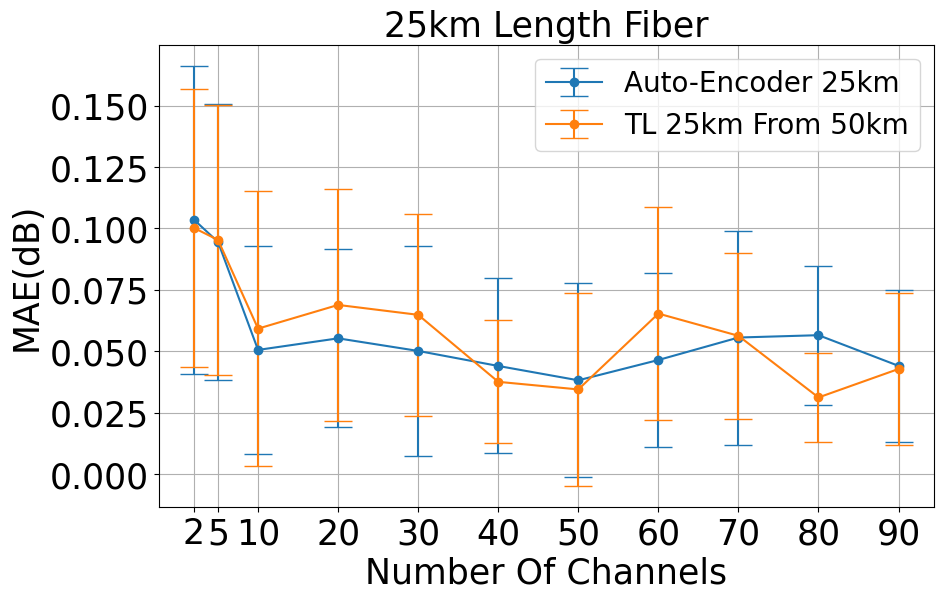
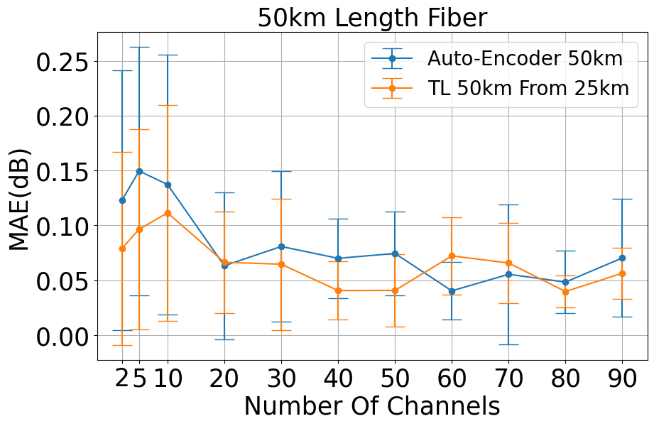

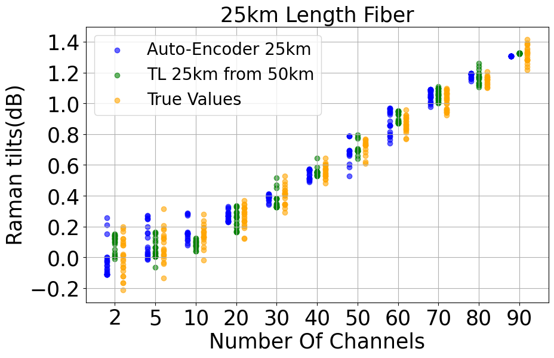
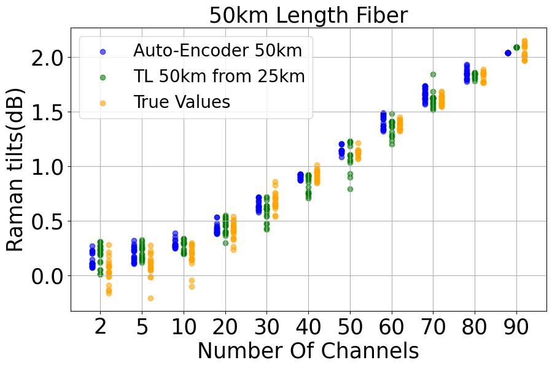

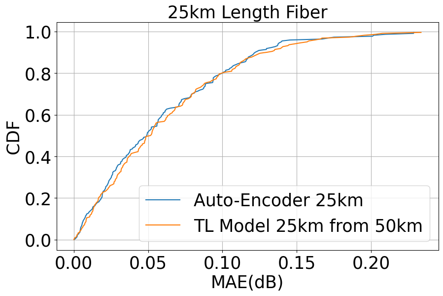
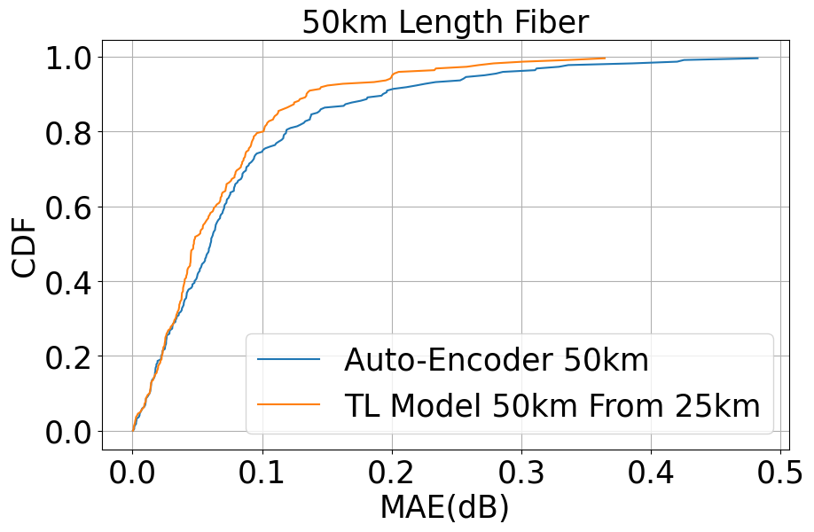